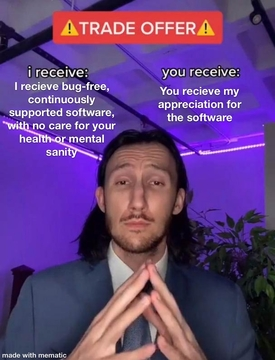

I am writing this post with sheer disgust of huge nagging that I am facing for an OSS project.
You might have seen me work quite a lot on Android ROMs/Kernels. Have you as a user read its license that it comes with?

```code 
Licensor provides the Work (and each Contributor provides its Contributions)
on an "AS IS" BASIS, WITHOUT WARRANTIES OR CONDITIONS OF ANY KIND,
either express or implied, including, without limitation,
any warranties or conditions of TITLE, NON-INFRINGEMENT,
MERCHANTABILITY, or FITNESS FOR A PARTICULAR PURPOSE.
```
 
Almost all common opensource licenses (Apache/MPL/GPL/BSD) have similar clauses of their own.
It’s worth taking a moment to consider the implications of this statement and what
it says about the social aspects of free and open source software.


Many people who rely on OSS software, feel entitled to get both support and maintainance at no cost.
Which is absolutely not true!





Some project maintainers may provide QA and support like RHEL/SLES, in the form of a contract. This isnt the case with FOSS, where you aren't required to sweat and cry for the community. Let alone QA, you aren't required to publish documentation,
or even a proper commit message. My very dear friend was being called out for having "Update files" as commit message on his repos. GPL requires you to just share sources with the community, which also implies you are very much allowed to tarball it and send it up, instead of publish to a public git repo with all perfect git history.

> Tip: OEMs have been doing this for years!


It is nice that a maintainer offers your free time, and helps you get his binaries running, but by no means they are required to.
As per the [free software definition](https://www.gnu.org/philosophy/free-sw.en.html) you have the right to make changes to the binary and redistribute your changes to others,
and to sell the software with or without those changes.

Selling the software, this reminds me of one incident where a person was asked to make their binaries free-of-cost, for including
a certain *.so file inside. There were so many people standing in support, but asking someone about this, after the sources
were licensed under Apache-2.0 felt little idiotic.

The hostile community, is the most correct word to describe the android community. People expecting third-party AOSP forks,
to perform without bugs in weird edge cases is totally not fine. You haven't given them a **WARRANTY** of any sort.
You aren't required to fix those issues they describe overnight banging your head on the PC. This doesn't imply to be rude
or harass a user for asking questions at you. You could help them, or atleast redirect them to a better place to fetch help.
Harassing a maintainer for publishing binaries that broke their phones, or something of the sort is also idiotic.
**YOU chose to make the changes.**
**YOU are the one responsible.**

As a maintainer, you need to be prepared to say __no__.
Working on your project should never feel like a curse.
You started it for a reason — remember that reason. Was it to lose your sanity? Or was it to have fun?
Was it to solve a specific problem you had? Or was it to solve problems for someone you’ve never met? 

If you enjoy helping others, then thats great! But don't tire yourself fixing issues that don't even bother you! Take your time fixing or attending only to those that really bother you. 

If you are a user, and were sent to this post, please understand that all your developer's sources are opensource. You can become a potential maintainer. Its not that you don't know C/Java/Makefile/Soong whatever. You can learn it through time, just google up! There is tons and tons of resources that made your maintainer what he is. There are so many telegram chats dedicated to helping people with all this. Learn doing this, fix bugs, make a pull request, and boom, you have done a nice contribution to the community you were a part of!

---

Thanks for listening to my rant!

This post was sponsored by the numerous people who spammed my DMs for getting a build of PixelExperience for OnePlus 7
